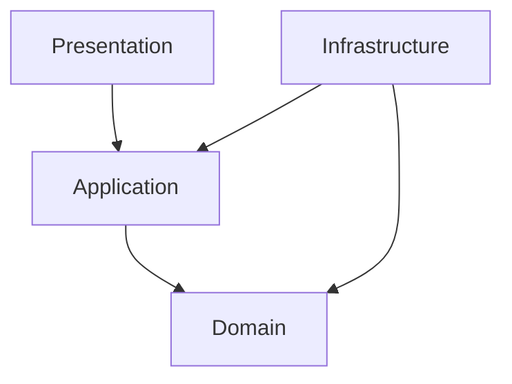

# flutter_ddd_riverpod_todo_app

このアプリはRiverpod + DDD(ドメイン駆動設計)を利用したサンプルアプリ

## 環境

- Flutter 2.10.5

## 構成
- ドメイン駆動設計の基本的な考え


## コマンド

### freezed

```shell
flutter pub run build_runner build --delete-conflicting-outputs
```

## Getting Started

This project is a starting point for a Flutter application.

A few resources to get you started if this is your first Flutter project:

- [Lab: Write your first Flutter app](https://flutter.dev/docs/get-started/codelab)
- [Cookbook: Useful Flutter samples](https://flutter.dev/docs/cookbook)

For help getting started with Flutter, view our
[online documentation](https://flutter.dev/docs), which offers tutorials,
samples, guidance on mobile development, and a full API reference.


## 参考リンク

### Riverpod関連
- [公式サイト](https://riverpod.dev/ja/)
- [Riverpodの基本的な使い方を整理してみる](https://zenn.dev/umatoma/articles/2026ef43bdb0f4)
  - ⚠️Riverpodのバージョンが古いので注意⚠️
- [Riverpodの基本的な使い方を整理してみる２](https://zenn.dev/umatoma/articles/f9cfe3371a32f4)
  - ⚠️Riverpodのバージョンが古いので注意⚠️

### ドメイン駆動設計関連
- [Dart/Flutterでドメイン駆動設計（DDD）してみた - 導入編](https://kabochapo.hateblo.jp/entry/2019/11/01/195130)
- [Dart/Flutterでドメイン駆動設計（DDD）してみた - 実装編](https://kabochapo.hateblo.jp/entry/2019/11/21/160759)
- [新卒にも伝わるドメイン駆動設計のアーキテクチャ説明(オニオンアーキテクチャ)[DDD]](https://little-hands.hatenablog.com/entry/2018/12/10/ddd-architecture)
- [ドメイン駆動設計入門 ボトムアップでわかる！ドメイン駆動設計の基本](https://www.amazon.co.jp/dp/B082WXZVPC)

### MVVM
- [Flutter を MVVM で実装する](https://wasabeef.medium.com/flutter-%E3%82%92-mvvm-%E3%81%A7%E5%AE%9F%E8%A3%85%E3%81%99%E3%82%8B-861c5dbcc565)
  - ⚠️Riverpodのバージョンが古いので注意⚠️
